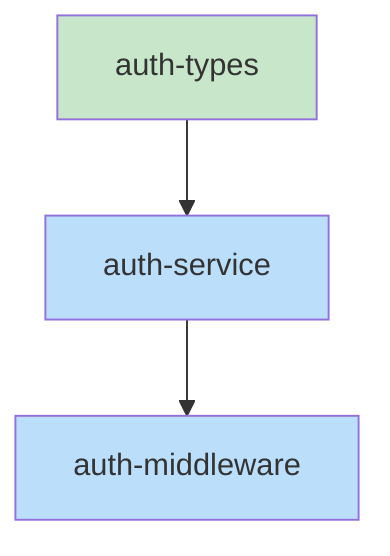

# Collab Workflow Design

> Design document from brainstorming session on 2025-01-18

## Problem/Goal

Create a structured creative-to-implementation pipeline that:
- Prevents context loss during long sessions (via persistent design docs)
- Catches design drift early with verification gates
- Enables parallel task execution with explicit dependency management
- Provides collaborative visual design via mermaid-collab

## Overview

New 4-stage pipeline with `collab` skill as entry point:

```
collab → brainstorming → rough-draft → implementation
```

## Key Decisions

1. **Collab folder location:** Project root (`.collab/`)
2. **Folder structure:** Mermaid-collab compatible (`diagrams/`, `documents/`, `metadata.json`)
3. **Server per collab:** Multiple servers on different ports (one per active collab)
4. **Template selection:** Feature, bugfix, refactor, spike
5. **Design document:** Grows organically with completeness gate before rough-draft
6. **Diagrams:** All embedded inline in design doc, synced via hook
7. **Rough-draft phases:** Interface → pseudocode → skeleton → implementation, each with verify
8. **Verification:** Design doc + diagrams + diff summary + pros/cons + user confirmation
9. **Task dependencies:** Explicit in skeleton phase, visualized with mermaid
10. **Finishing:** Copy to `docs/designs/<collab-name>/`, ask to delete collab folder
11. **Resume:** Phase + pending issues + timestamp
12. **Port assignment:** Sequential from 3737, tracked in `.collab/ports.json`
13. **Naming:** Adjective-adjective-noun pattern (e.g., `happy-blue-mountain`)

## Architecture

### Skills to Create/Modify

| Skill | Status | Purpose |
|-------|--------|---------|
| `collab` | **New** | Entry point. Creates/resumes collab sessions, spawns mermaid server |
| `brainstorming` | **Modify** | Enhance with live design doc updates, diagram sync hooks |
| `rough-draft` | **New** | 4-phase refinement: interface → pseudocode → skeleton → implementation |
| `executing-plans` | **Modify** | Consume task dependency graph, respect parallel/sequential |

### Hooks to Create

| Hook | Trigger | Purpose |
|------|---------|---------|
| `sync-diagram-to-doc` | After `create_diagram`/`update_diagram` | Keep embedded diagrams aligned with source |
| `verify-phase` | Before phase transitions | Check design alignment, show diff, get confirmation |
| `collab-cleanup` | After implementation complete | Prompt to copy artifacts and delete collab folder |

### Mermaid-Collab Server Changes

- Add `STORAGE_DIR` env var to config
- Make `MetadataManager` accept configurable path
- Enable multiple instances on different ports

## Collab Skill

Entry point for all collaborative design work.

### Flow

```
/collab
   ↓
.collab/ exists? → No → Create it
   ↓
"New collab or resume existing?"
   ↓
┌─────────────────┬──────────────────────────┐
│ New             │ Resume                   │
├─────────────────┼──────────────────────────┤
│ Select template │ List existing collabs    │
│ (feature/bug/   │ Show phase + last active │
│  refactor/spike)│ User selects one         │
├─────────────────┼──────────────────────────┤
│ Generate name   │ Load state from metadata │
│ (adj-adj-noun)  │                          │
├─────────────────┼──────────────────────────┤
│ Create folder   │ Check for pending        │
│ structure       │ verification issues      │
├─────────────────┴──────────────────────────┤
│ Assign port (next available from 3737)     │
│ Spawn mermaid-collab server                │
│ Read design doc into context               │
│ Transition to current phase skill          │
└────────────────────────────────────────────┘
```

### Folder Structure

```
.collab/
├── ports.json                    # {port: collab-name} mapping
└── happy-blue-mountain/
    ├── diagrams/                 # .mmd files
    ├── documents/                # .md files (including design doc)
    ├── metadata.json             # mermaid-collab metadata
    └── collab-state.json         # phase, pending issues, timestamps
```

### State Tracking (`collab-state.json`)

```json
{
  "phase": "rough-draft:skeleton",
  "template": "feature",
  "lastActivity": "2025-01-18T10:30:00Z",
  "pendingVerificationIssues": [],
  "serverPid": 12345
}
```

## Brainstorming Modifications

### Key Changes

1. **Live design document** - Created immediately, updated continuously
2. **Organic growth with completeness gate:**
   - Sections added as topics emerge
   - Before rough-draft, verify required sections:
     - Problem/Goal
     - Key decisions
     - At least one diagram
     - Success criteria
     - Out of scope
3. **All diagrams embedded inline** in design doc

### Sync Hook (`sync-diagram-to-doc`)

```
Trigger: After create_diagram or update_diagram

Action:
1. Get diagram ID and content from tool result
2. Find design doc in current collab
3. If diagram ID exists in doc → replace mermaid code block
4. If new diagram → append new section with embedded code
5. Update doc via update_document
```

### Template-Specific Focus

| Template | Brainstorming emphasis |
|----------|----------------------|
| Feature | Full design, wireframes, architecture |
| Bugfix | Reproduction, root cause, minimal fix |
| Refactor | Before/after, migration path |
| Spike | Time-boxed scope, success criteria |

## Rough-Draft Skill

Bridges brainstorming to implementation through progressive refinement.

### Four Phases with Verification Gates

```
┌─────────────┐     ┌─────────────┐     ┌─────────────┐     ┌─────────────┐
│  Interface  │────▶│ Pseudocode  │────▶│  Skeleton   │────▶│   Implement │
└──────┬──────┘     └──────┬──────┘     └──────┬──────┘     └──────┬──────┘
       │                   │                   │                   │
       ▼                   ▼                   ▼                   ▼
   ┌───────┐           ┌───────┐           ┌───────┐           ┌───────┐
   │Verify │           │Verify │           │Verify │           │Verify │
   └───────┘           └───────┘           └───────┘           └───────┘
```

**Phase 1: Interface**
- Define file paths to create/modify
- Class and function signatures
- Public API contracts
- Output: Interface section in design doc

**Phase 2: Pseudocode**
- Logic flow for each function
- Error handling approach
- Edge cases identified
- Output: Pseudocode section in design doc

**Phase 3: Skeleton**
- Generate actual stub files with types and TODOs
- Task dependency graph with explicit `depends-on` declarations
- Mermaid diagram of task dependencies
- Output: Skeleton files + dependency graph in design doc

**Phase 4: Implementation**
- Hand off to `executing-plans` with dependency graph
- Parallel tasks via `subagent-driven-development`
- Sequential tasks in order

## Verification Hook

### Checks Performed

```
┌─────────────────────────────────────────────┐
│              verify-phase hook              │
├─────────────────────────────────────────────┤
│ 1. Load design doc from collab              │
│ 2. Load all embedded diagrams               │
│ 3. Compare current artifacts to design:     │
│    - Interface signatures match?            │
│    - All defined components present?        │
│    - No undocumented additions?             │
│ 4. Generate diff summary with pros/cons     │
│ 5. Present to user for confirmation         │
└─────────────────────────────────────────────┘
```

### Diff Summary Format

```markdown
## Verification: rough-draft:skeleton

### Aligned ✓
- AuthService interface matches design
- UserRepository signatures match

### Drift detected ⚠️

**1. `ErrorHandler.handle()` has extra `context` param**
   - Design: `handle(error: Error)`
   - Code: `handle(error: Error, context?: RequestContext)`

   Pros:
   - Enables better error logging with request details
   - Optional param, doesn't break existing calls

   Cons:
   - Adds coupling to RequestContext type
   - Wasn't discussed in design—may have hidden implications

**2. Missing: `RateLimiter` class**
   - Defined in interface phase, not in skeleton

   Pros of keeping it out:
   - Simpler initial implementation
   - Could add later as enhancement

   Cons:
   - Design specified it for a reason (API protection)
   - May be harder to add later

### Recommendation
Issue 1: Consider accepting (low risk, clear benefit)
Issue 2: Recommend fixing (security implication)

Proceed? [accept all / reject all / review each]
```

### User Options

| Choice | Action |
|--------|--------|
| Accept | Auto-update design doc to match code, log decision |
| Reject | Stay in phase, fix code to match design |
| Review each | Decide per-issue |

### Decision Log

When drift is accepted, append to design doc:

```markdown
## Decision Log

### 2025-01-18: Added context param to ErrorHandler.handle()
- **Phase:** rough-draft:skeleton
- **Original:** `handle(error: Error)`
- **Changed to:** `handle(error: Error, context?: RequestContext)`
- **Reason:** Enables better error logging with request details
```

## Task Dependency Graph

Generated during skeleton phase, consumed by `executing-plans`.

### Format

```yaml
## Task Dependency Graph

tasks:
  - id: auth-types
    files: [src/auth/types.ts]
    description: Core auth type definitions
    parallel: true

  - id: auth-service
    files: [src/auth/service.ts]
    description: Authentication service implementation
    depends-on: [auth-types]

  - id: auth-middleware
    files: [src/middleware/auth.ts]
    description: Express middleware for auth
    depends-on: [auth-service]
```

### Mermaid Visualization



### Execution by `executing-plans`

1. Parse dependency graph from design doc
2. Build execution order (topological sort)
3. Tasks with no unmet dependencies → dispatch in parallel via `subagent-driven-development`
4. As tasks complete, unlock dependent tasks
5. Verify after each task completion

## Finishing & Cleanup

### Flow

```
Implementation complete + verified
     ↓
"Copy artifacts to project?"
     ↓
Copy to docs/designs/<collab-name>/
├── design.md
├── diagrams/
├── decision-log.md
└── dependency-graph.md
     ↓
"Delete collab folder?"
     ↓
Yes → Delete folder, release port, stop server
No  → Keep for reference
```

### Git Commit

```
docs: add design artifacts for <collab-name>

- Design document with architecture decisions
- Mermaid diagrams (flow, wireframes, etc.)
- Task dependency graph
```

## Error Handling

### Server Failures

| Scenario | Handling |
|----------|----------|
| Server won't start | Retry once, ask user to check port |
| Server crashes | Auto-restart on next tool call |
| Port in use | Find next available, update ports.json |

### State Issues

| Scenario | Handling |
|----------|----------|
| `collab-state.json` corrupted | Infer phase from doc, ask user to confirm |
| Design doc missing | Cannot recover—start new collab |
| Diagram missing | Re-create from embedded code in doc |

### Phase Transition Failures

| Scenario | Handling |
|----------|----------|
| Verification fails repeatedly | After 3 attempts, offer skip with warning |
| User abandons mid-phase | State saved for resume |
| Dependency graph has cycle | Flag error, require fix |

## Success Criteria

- [ ] Can create new collab with template selection
- [ ] Can resume existing collab with state restoration
- [ ] Multiple collabs can run simultaneously on different ports
- [ ] Design doc updates persist and survive context compaction
- [ ] Verification catches drift and shows pros/cons
- [ ] Accepted drift auto-updates design doc with decision log
- [ ] Task dependency graph executes with correct parallelization
- [ ] Artifacts copy to project on completion
- [ ] Cleanup properly stops server and releases port

## Out of Scope

- Automatic conflict resolution between collabs modifying same files
- Version control for design docs within collab (git handles this)
- Multi-user real-time collaboration (single user per collab)
- Integration with external design tools (Figma, etc.)
