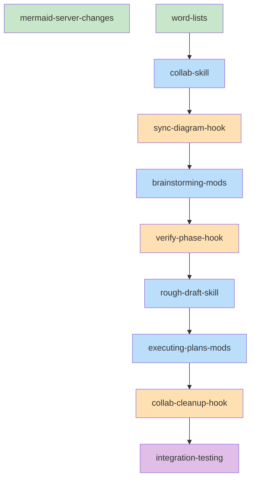

# Collab Workflow Implementation Plan

> **For Claude:** REQUIRED SUB-SKILL: Use superpowers:executing-plans to implement this plan task-by-task.

**Goal:** Create a structured creative-to-implementation pipeline with persistent design docs, verification gates, and parallel task execution.

**Architecture:** New `collab` skill as entry point, enhanced `brainstorming` with live doc updates, new `rough-draft` skill with 4-phase refinement, and modified `executing-plans` to consume task dependency graphs.

**Tech Stack:** Bash hooks, Markdown skills, Mermaid-collab MCP server (TypeScript/Bun)

**Design Artifacts:**
- Design doc: `docs/plans/2025-01-18-collab-workflow-design.md`

---

## Task Dependency Graph

```yaml
tasks:
  - id: mermaid-server-changes
    files: [~/Code/claude-mermaid-collab/src/config.ts, ~/Code/claude-mermaid-collab/src/metadata-manager.ts]
    description: Add STORAGE_DIR support to mermaid-collab server
    parallel: true

  - id: word-lists
    files: [lib/words/adjectives.txt, lib/words/nouns.txt]
    description: Create word lists for random naming
    parallel: true

  - id: collab-skill
    files: [skills/collab/SKILL.md]
    description: Create collab skill entry point
    depends-on: [word-lists]

  - id: sync-diagram-hook
    files: [hooks/sync-diagram-to-doc.sh, hooks/hooks.json]
    description: Hook to sync diagrams to design doc
    depends-on: [collab-skill]

  - id: brainstorming-mods
    files: [skills/brainstorming/SKILL.md]
    description: Modify brainstorming for live doc updates
    depends-on: [sync-diagram-hook]

  - id: verify-phase-hook
    files: [hooks/verify-phase.sh, hooks/hooks.json]
    description: Verification hook with drift detection
    depends-on: [brainstorming-mods]

  - id: rough-draft-skill
    files: [skills/rough-draft/SKILL.md]
    description: Create rough-draft skill with 4 phases
    depends-on: [verify-phase-hook]

  - id: executing-plans-mods
    files: [skills/executing-plans/SKILL.md]
    description: Modify executing-plans for dependency graph
    depends-on: [rough-draft-skill]

  - id: collab-cleanup-hook
    files: [hooks/collab-cleanup.sh, hooks/hooks.json]
    description: Cleanup hook for finishing collabs
    depends-on: [executing-plans-mods]

  - id: integration-testing
    files: [tests/collab-workflow/]
    description: End-to-end test scenarios
    depends-on: [collab-cleanup-hook]
```



Legend: Green = parallel-safe, Blue = skill, Orange = hook, Purple = testing

---

## Task 1: Mermaid Server Changes

**Files:**
- Modify: `~/Code/claude-mermaid-collab/src/config.ts`
- Modify: `~/Code/claude-mermaid-collab/src/metadata-manager.ts`
- Modify: `~/Code/claude-mermaid-collab/src/server.ts`

**Design Reference:**
- Design Doc: `docs/plans/2025-01-18-collab-workflow-design.md` section "Mermaid-Collab Server Changes"

**Step 1: Read current config.ts**

Read the file to understand current structure.

**Step 2: Add STORAGE_DIR to config**

```typescript
// Add to config object:
STORAGE_DIR: process.env.STORAGE_DIR || '.',
```

**Step 3: Update path derivations**

```typescript
// Change from hardcoded to derived:
get DIAGRAMS_FOLDER() { return join(this.STORAGE_DIR, 'diagrams') },
get DOCUMENTS_FOLDER() { return join(this.STORAGE_DIR, 'documents') },
get METADATA_FILE() { return join(this.STORAGE_DIR, 'metadata.json') },
```

**Step 4: Read metadata-manager.ts**

Read to find hardcoded path.

**Step 5: Update MetadataManager**

Replace hardcoded `./metadata.json` with config reference.

**Step 6: Update server.ts**

Ensure managers use config paths on initialization.

**Step 7: Test multiple instances**

```bash
# Terminal 1
cd ~/Code/claude-mermaid-collab
PORT=3737 STORAGE_DIR=/tmp/collab1 bun run src/server.ts

# Terminal 2
PORT=3738 STORAGE_DIR=/tmp/collab2 bun run src/server.ts
```

Verify both servers run independently.

**Step 8: Commit**

```bash
cd ~/Code/claude-mermaid-collab
git add -A
git commit -m "feat: add STORAGE_DIR support for multi-instance"
```

---

## Task 2: Word Lists for Random Naming

**Files:**
- Create: `lib/words/adjectives.txt`
- Create: `lib/words/nouns.txt`

**Design Reference:**
- Design Doc: section "Collab Skill" - adjective-adjective-noun pattern

**Step 1: Create lib/words directory**

```bash
mkdir -p lib/words
```

**Step 2: Create adjectives.txt**

Create file with ~100 simple, positive adjectives (one per line):

```
bright
calm
clear
cool
...
```

**Step 3: Create nouns.txt**

Create file with ~100 concrete, memorable nouns (one per line):

```
river
mountain
forest
meadow
...
```

**Step 4: Commit**

```bash
git add lib/words/
git commit -m "feat: add word lists for collab naming"
```

---

## Task 3: Collab Skill

**Files:**
- Create: `skills/collab/SKILL.md`

**Design Reference:**
- Design Doc: section "Collab Skill" - full flow diagram

**Step 1: Create skill directory**

```bash
mkdir -p skills/collab
```

**Step 2: Write SKILL.md**

Create the skill file with:
- Frontmatter (name, description)
- Overview explaining entry point purpose
- New collab flow (template selection, name generation, folder creation, server spawn)
- Resume collab flow (list existing, load state, check pending issues)
- Port management logic
- Server lifecycle management
- State tracking format

Key sections:
- Template selection (feature/bugfix/refactor/spike)
- Name generation (read random words, combine adj-adj-noun)
- Folder structure creation
- Port assignment from ports.json
- Server spawning with STORAGE_DIR
- Transition to brainstorming

**Step 3: Verify skill structure**

Check against existing skills for format consistency.

**Step 4: Commit**

```bash
git add skills/collab/
git commit -m "feat: add collab skill as entry point"
```

---

## Task 4: Sync Diagram Hook

**Files:**
- Create: `hooks/sync-diagram-to-doc.sh`
- Modify: `hooks/hooks.json`

**Design Reference:**
- Design Doc: section "Brainstorming Modifications" - sync hook

**Step 1: Read current hooks.json**

Understand existing hook structure.

**Step 2: Create sync-diagram-to-doc.sh**

```bash
#!/bin/bash
# Triggered after create_diagram or update_diagram
# Syncs diagram content to design doc

# Parse tool result for diagram ID and content
# Find design doc in current collab
# Update or append mermaid block
```

**Step 3: Update hooks.json**

Add hook configuration for mermaid tool triggers.

**Step 4: Make executable**

```bash
chmod +x hooks/sync-diagram-to-doc.sh
```

**Step 5: Commit**

```bash
git add hooks/
git commit -m "feat: add sync-diagram-to-doc hook"
```

---

## Task 5: Brainstorming Modifications

**Files:**
- Modify: `skills/brainstorming/SKILL.md`

**Design Reference:**
- Design Doc: section "Brainstorming Modifications"

**Step 1: Read current brainstorming skill**

Understand existing structure and flow.

**Step 2: Add live design doc section**

Add instructions for:
- Create design doc immediately when brainstorming starts
- Update continuously as topics emerge
- All diagrams embedded inline

**Step 3: Add completeness gate**

Before transition to rough-draft, verify:
- Problem/Goal section exists
- Key decisions documented
- At least one diagram present
- Success criteria defined
- Out of scope section exists

**Step 4: Add template-specific focus**

Different emphasis per template type.

**Step 5: Add context preservation instructions**

Re-read design doc to restore context after compaction.

**Step 6: Update integration section**

Reference collab skill as caller, rough-draft as next phase.

**Step 7: Commit**

```bash
git add skills/brainstorming/
git commit -m "feat: enhance brainstorming with live doc updates"
```

---

## Task 6: Verify Phase Hook

**Files:**
- Create: `hooks/verify-phase.sh`
- Modify: `hooks/hooks.json`

**Design Reference:**
- Design Doc: section "Verification Hook"

**Step 1: Create verify-phase.sh**

```bash
#!/bin/bash
# Triggered before phase transitions
# Checks design alignment, shows diff with pros/cons

# Load design doc
# Compare artifacts to design
# Generate diff summary
# Show pros/cons for each drift
# Prompt for user decision
# Auto-update design doc if drift accepted
# Log decisions to decision log
```

**Step 2: Implement drift detection logic**

Compare:
- Interface signatures
- Component presence
- Undocumented additions

**Step 3: Implement pros/cons generation**

Analyze drift type and generate contextual pros/cons.

**Step 4: Implement design doc auto-update**

When drift accepted, update design doc and append to decision log.

**Step 5: Update hooks.json**

Add hook configuration.

**Step 6: Make executable**

```bash
chmod +x hooks/verify-phase.sh
```

**Step 7: Commit**

```bash
git add hooks/
git commit -m "feat: add verify-phase hook with drift detection"
```

---

## Task 7: Rough-Draft Skill

**Files:**
- Create: `skills/rough-draft/SKILL.md`

**Design Reference:**
- Design Doc: section "Rough-Draft Skill"

**Step 1: Create skill directory**

```bash
mkdir -p skills/rough-draft
```

**Step 2: Write SKILL.md with 4 phases**

**Phase 1: Interface**
- Define file paths
- Class/function signatures
- Public API contracts

**Phase 2: Pseudocode**
- Logic flow for each function
- Error handling approach
- Edge cases

**Phase 3: Skeleton**
- Generate stub files
- Task dependency graph
- Mermaid visualization

**Phase 4: Implementation handoff**
- Pass to executing-plans
- Provide dependency graph

**Step 3: Add verification gate instructions**

Call verify-phase hook before each transition.

**Step 4: Add state tracking**

Update collab-state.json with current phase.

**Step 5: Commit**

```bash
git add skills/rough-draft/
git commit -m "feat: add rough-draft skill with 4 phases"
```

---

## Task 8: Executing-Plans Modifications

**Files:**
- Modify: `skills/executing-plans/SKILL.md`

**Design Reference:**
- Design Doc: section "Task Dependency Graph" - execution

**Step 1: Read current executing-plans skill**

Understand existing structure.

**Step 2: Add dependency graph parsing**

Instructions to:
- Parse task dependency graph from design doc
- Build execution order (topological sort)
- Identify parallel-safe tasks

**Step 3: Add parallel dispatch logic**

When tasks have no unmet dependencies:
- Dispatch in parallel via subagent-driven-development

**Step 4: Add per-task verification**

After each task:
- Run verify-phase for that task
- Unlock dependent tasks on success

**Step 5: Update integration section**

Reference rough-draft as caller.

**Step 6: Commit**

```bash
git add skills/executing-plans/
git commit -m "feat: add dependency graph support to executing-plans"
```

---

## Task 9: Collab Cleanup Hook

**Files:**
- Create: `hooks/collab-cleanup.sh`
- Modify: `hooks/hooks.json`

**Design Reference:**
- Design Doc: section "Finishing & Cleanup"

**Step 1: Create collab-cleanup.sh**

```bash
#!/bin/bash
# Triggered after final implementation verification

# Prompt to copy artifacts to docs/designs/<collab-name>/
# Copy design doc, diagrams, decision log
# Prompt to delete collab folder
# If yes: stop server, release port, delete folder
# Generate git commit
```

**Step 2: Implement artifact copying**

Copy to `docs/designs/<collab-name>/`:
- design.md
- diagrams/
- decision-log.md (if exists)
- dependency-graph.md

**Step 3: Implement server shutdown**

Read PID from collab-state.json, send SIGTERM.

**Step 4: Implement port release**

Remove entry from ports.json.

**Step 5: Update hooks.json**

Add hook configuration.

**Step 6: Make executable**

```bash
chmod +x hooks/collab-cleanup.sh
```

**Step 7: Commit**

```bash
git add hooks/
git commit -m "feat: add collab-cleanup hook"
```

---

## Task 10: Integration Testing

**Files:**
- Create: `tests/collab-workflow/README.md`
- Create: `tests/collab-workflow/new-feature-flow.md`
- Create: `tests/collab-workflow/resume-flow.md`
- Create: `tests/collab-workflow/verification-drift.md`

**Design Reference:**
- Design Doc: section "Success Criteria"

**Step 1: Create test directory**

```bash
mkdir -p tests/collab-workflow
```

**Step 2: Write README.md**

Overview of test scenarios and how to run them.

**Step 3: Write new-feature-flow.md**

Manual test script for:
- Create new collab with feature template
- Go through brainstorming
- Progress through rough-draft phases
- Complete implementation
- Verify artifacts copied
- Verify cleanup works

**Step 4: Write resume-flow.md**

Manual test script for:
- Create collab, stop mid-brainstorm
- Resume and verify state restored
- Create collab, stop mid-rough-draft with pending issues
- Resume and verify issues shown

**Step 5: Write verification-drift.md**

Manual test script for:
- Introduce intentional drift
- Verify drift detected with pros/cons
- Accept drift, verify design doc updated
- Reject drift, verify code needs fixing

**Step 6: Commit**

```bash
git add tests/collab-workflow/
git commit -m "test: add collab workflow integration tests"
```

---

## Execution Checklist

- [ ] Task 1: Mermaid server changes (parallel-safe)
- [ ] Task 2: Word lists (parallel-safe)
- [ ] Task 3: Collab skill
- [ ] Task 4: Sync diagram hook
- [ ] Task 5: Brainstorming modifications
- [ ] Task 6: Verify phase hook
- [ ] Task 7: Rough-draft skill
- [ ] Task 8: Executing-plans modifications
- [ ] Task 9: Collab cleanup hook
- [ ] Task 10: Integration testing

---

## Post-Implementation

After all tasks complete:
1. Run full integration test (new-feature-flow.md)
2. Use `superpowers:finishing-a-development-branch` to merge/PR
