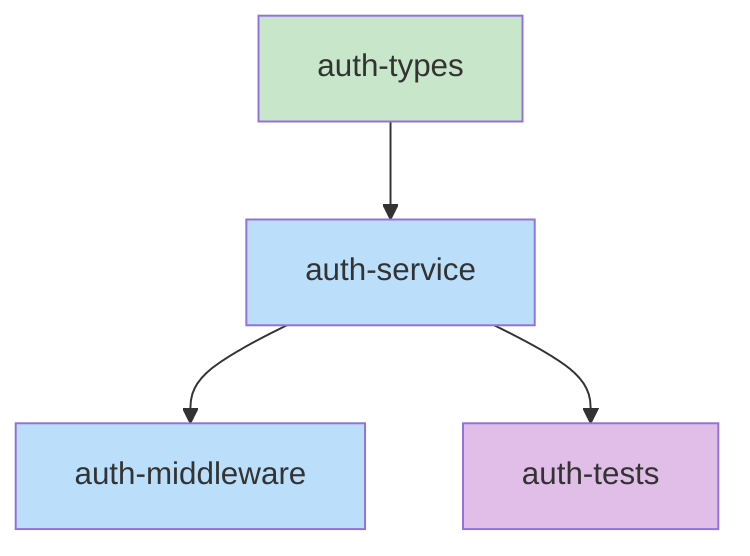
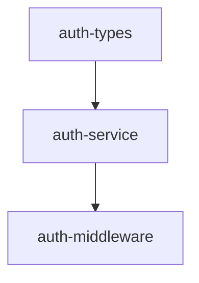
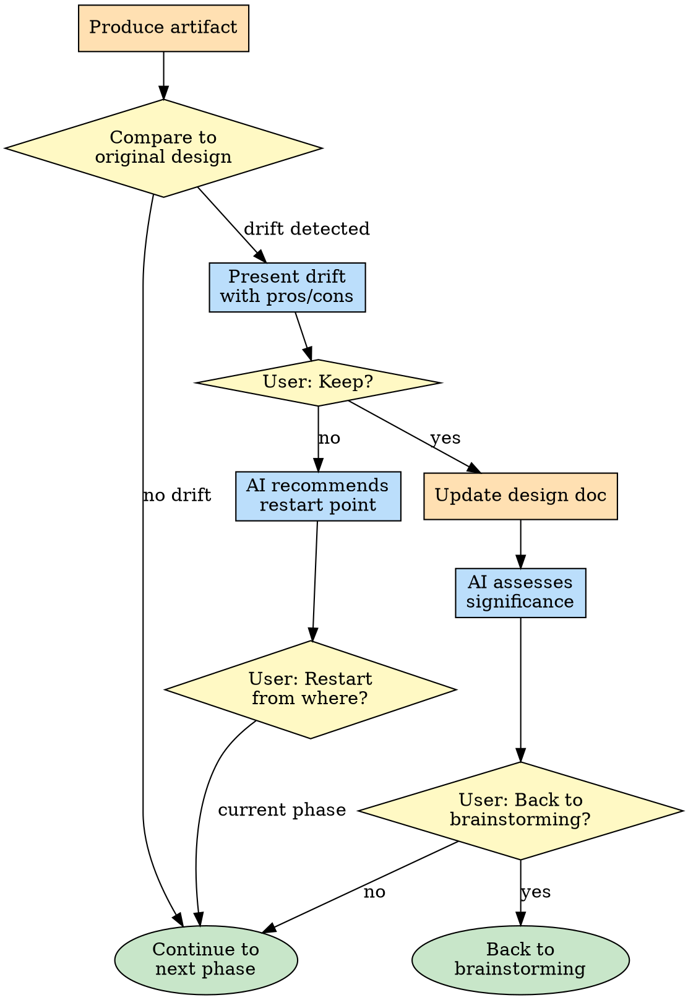
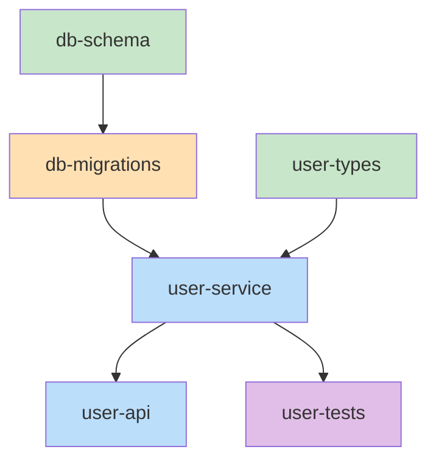

# Rough-Draft: From Design to Implementation

## Overview

The rough-draft skill bridges the gap between brainstorming (design) and implementation. It progressively refines the design through 4 phases, with verification gates at each transition to catch drift early.

```
+--------------+     +--------------+     +--------------+     +--------------+
|  Interface   |---->|  Pseudocode  |---->|   Skeleton   |---->|  Implement   |
+------+-------+     +------+-------+     +------+-------+     +------+-------+
       |                    |                    |                    |
       v                    v                    v                    v
  +--------+           +--------+           +--------+           +--------+
  | Verify |           | Verify |           | Verify |           | Verify |
  +--------+           +--------+           +--------+           +--------+
```

**Announce at start:** "I'm using the rough-draft skill to refine the design through interface, pseudocode, skeleton, and implementation handoff."

## Prerequisites

Before starting rough-draft, ensure:
- Design doc exists at `.collab/<name>/documents/design.md`
- Design doc passed brainstorming's completeness gate
- `collab-state.json` phase is set to `rough-draft/interface`

## Writing Quality

When writing interfaces and pseudocode, use clear, precise language.

**If `obra/the-elements-of-style` plugin is available**, invoke it for guidance on:
- Omitting needless words
- Using active voice
- Being specific, not vague

Apply these principles to interface documentation and pseudocode comments.

## Phase 1: Interface

Define the structural contracts of the system.

### What to Produce

1. **File paths** - List all files that will be created or modified
2. **Class and function signatures** - Names, parameters, return types
3. **Public API contracts** - How components interact with each other
4. **Type definitions** - Custom types, interfaces, enums

### Process

```bash
# Read design doc
cat .collab/<name>/documents/design.md
```

**For each component identified in design:**
1. Define the file path where it will live
2. List all public functions/methods with signatures
3. Define input/output types
4. Document how it connects to other components

### Output Format

Add an "Interface Definition" section to the design doc:

```markdown
## Interface Definition

### File Structure
- `src/auth/types.ts` - Core type definitions
- `src/auth/service.ts` - Authentication service
- `src/auth/middleware.ts` - Express middleware

### Type Definitions

```typescript
// src/auth/types.ts
interface User {
  id: string;
  email: string;
  role: 'admin' | 'user';
}

interface AuthResult {
  success: boolean;
  user?: User;
  error?: string;
}
```

### Function Signatures

```typescript
// src/auth/service.ts
class AuthService {
  authenticate(email: string, password: string): Promise<AuthResult>
  validateToken(token: string): Promise<User | null>
  revokeToken(token: string): Promise<void>
}

// src/auth/middleware.ts
function requireAuth(req: Request, res: Response, next: NextFunction): void
function requireRole(role: string): Middleware
```

### Component Interactions
- `middleware.requireAuth` calls `service.validateToken`
- `service.authenticate` returns tokens stored in Redis
```

### Verification Gate

Before moving to Phase 2, run verification:

```bash
# Trigger verify-phase hook
./hooks/verify-phase.sh interface <collab-name>
```

**Checklist:**
- [ ] All files from design are listed
- [ ] All public interfaces have signatures
- [ ] Parameter types are explicit (no `any`)
- [ ] Return types are explicit
- [ ] Component interactions are documented

**Update state on success:**

```
Tool: mcp__mermaid__update_collab_session_state
Args: { "sessionName": "<name>", "phase": "rough-draft/pseudocode" }
```

---

## Phase 2: Pseudocode

Define the logic flow for each function.

### What to Produce

1. **Logic flow** - Step-by-step description of what each function does
2. **Error handling approach** - How errors are caught, propagated, reported
3. **Edge cases** - Boundary conditions and how they're handled
4. **Dependencies** - External services, databases, APIs called

### Process

For each function from the Interface phase:
1. Write plain-language pseudocode
2. Identify error conditions
3. List edge cases
4. Note any external calls

### Output Format

Add a "Pseudocode" section to the design doc:

```markdown
## Pseudocode

### AuthService.authenticate(email, password)

```
1. Validate email format
   - If invalid: return { success: false, error: "Invalid email format" }

2. Look up user by email in database
   - If not found: return { success: false, error: "User not found" }

3. Verify password hash
   - If mismatch: return { success: false, error: "Invalid password" }
   - Rate limit: after 5 failures, lock account for 15 minutes

4. Generate JWT token
   - Include: user.id, user.role, expiry (1 hour)

5. Store token in Redis with TTL
   - Key: "token:{tokenId}", Value: user.id

6. Return { success: true, user, token }
```

**Error Handling:**
- Database errors: Log and return generic "Authentication failed"
- Redis errors: Fall back to stateless JWT (no revocation support)

**Edge Cases:**
- Empty password: Reject before hashing
- Expired account: Check `user.expiresAt` before authenticating
- Concurrent logins: Allow (no session limit)
```

### Verification Gate

Before moving to Phase 3, run verification:

```bash
./hooks/verify-phase.sh pseudocode <collab-name>
```

**Checklist:**
- [ ] Every function from Interface has pseudocode
- [ ] Error handling is explicit for each function
- [ ] Edge cases are identified
- [ ] External dependencies are noted

**Update state on success:**

```
Tool: mcp__mermaid__update_collab_session_state
Args: { "sessionName": "<name>", "phase": "rough-draft/skeleton" }
```

---

## Phase 3: Skeleton

Generate actual stub files and the task dependency graph.

### What to Produce

1. **Stub files** - Real files with types and TODO comments
2. **Task dependency graph** - YAML format with explicit dependencies
3. **Mermaid visualization** - Visual diagram of task dependencies

### Process

**Step 1: Generate stub files**

For each file in the Interface:
1. Create the file with proper directory structure
2. Add all type definitions
3. Add all function signatures with TODO bodies
4. Include imports based on dependencies

```typescript
// src/auth/service.ts

import { User, AuthResult } from './types';
import { db } from '../database';
import { redis } from '../cache';

export class AuthService {
  async authenticate(email: string, password: string): Promise<AuthResult> {
    // TODO: Implement authentication logic
    // - Validate email format
    // - Look up user by email
    // - Verify password hash
    // - Generate JWT token
    // - Store in Redis
    throw new Error('Not implemented');
  }

  async validateToken(token: string): Promise<User | null> {
    // TODO: Implement token validation
    // - Verify JWT signature
    // - Check Redis for revocation
    // - Return user if valid
    throw new Error('Not implemented');
  }

  async revokeToken(token: string): Promise<void> {
    // TODO: Implement token revocation
    // - Remove from Redis
    throw new Error('Not implemented');
  }
}
```

**Step 2: Build task dependency graph**

Analyze dependencies between files to determine execution order:

```yaml
tasks:
  - id: auth-types
    files: [src/auth/types.ts]
    description: Core auth type definitions
    parallel: true

  - id: auth-service
    files: [src/auth/service.ts]
    description: Authentication service implementation
    depends-on: [auth-types]

  - id: auth-middleware
    files: [src/auth/middleware.ts]
    description: Express authentication middleware
    depends-on: [auth-service]

  - id: auth-tests
    files: [src/auth/__tests__/service.test.ts]
    description: Unit tests for auth service
    depends-on: [auth-service]
```

**Step 3: Create Mermaid visualization**



Legend: Green = parallel-safe (no dependencies), Blue = sequential, Purple = tests

### Output Format

Add to the design doc:

```markdown
## Skeleton

### Generated Files
- [x] `src/auth/types.ts` - Created with type definitions
- [x] `src/auth/service.ts` - Created with stub methods
- [x] `src/auth/middleware.ts` - Created with stub functions

### Task Dependency Graph

```yaml
tasks:
  - id: auth-types
    files: [src/auth/types.ts]
    description: Core auth type definitions
    parallel: true

  - id: auth-service
    files: [src/auth/service.ts]
    description: Authentication service implementation
    depends-on: [auth-types]

  - id: auth-middleware
    files: [src/auth/middleware.ts]
    description: Express authentication middleware
    depends-on: [auth-service]
```

### Dependency Visualization


```

### Verification Gate

Before moving to Phase 4, run verification:

```bash
./hooks/verify-phase.sh skeleton <collab-name>
```

**Checklist:**
- [ ] All files from Interface are created
- [ ] File paths match exactly
- [ ] All types are defined
- [ ] All function signatures present
- [ ] TODO comments match pseudocode
- [ ] Dependency graph covers all files
- [ ] No circular dependencies

**Update state on success:**

```
Tool: mcp__mermaid__update_collab_session_state
Args: { "sessionName": "<name>", "phase": "implementation" }
```

---

## Proposed Tag Workflow

For each phase (INTERFACE, PSEUDOCODE, SKELETON), use the proposed tag workflow before verification:

1. Write artifact to design doc with `[PROPOSED]` marker
2. Tell user: "I've added the [interface/pseudocode/skeleton] to the design doc. Please review."
3. Ask: "Does this look right?"
4. If accepted: remove `[PROPOSED]` marker, proceed to drift check
5. If rejected: discuss, revise, repeat

This ensures user reviews each artifact before it becomes part of the design.

---

## Drift Detection

After each phase's `[PROPOSED]` content is accepted, check if it matches the original design.



### When to Check for Drift

Run drift detection after each phase's artifact is accepted:
- After INTERFACE accepted → compare to original design
- After PSEUDOCODE accepted → compare to design + interface
- After SKELETON accepted → compare to design + interface + pseudocode

### Presenting Drift

When drift is detected, present it clearly:

```
**Drift detected:** [What changed]

**Original design:** [What the design doc specified]
**Current artifact:** [What was just produced]

**Pros:**
- [Benefit 1]
- [Benefit 2]

**Cons:**
- [Drawback 1]
- [Drawback 2]

**Recommendation:** [Keep/Discard] - [Reasoning]

Keep this change? [Yes / No]
```

### If User Keeps Change

1. Design doc is already updated (via accepted proposal)
2. Assess significance:
   - **Minor:** Affects one component, no architectural change
   - **Significant:** Affects multiple components or changes architecture
3. Present: "This is [minor/significant] because [reasons]. I recommend [continuing/returning to brainstorming]."
4. Ask: "Go back to brainstorming? [Yes / No]"
5. If yes → transition to brainstorming skill
6. If no → continue to next rough-draft phase

### If User Discards Change

1. Revert the design doc to before the proposal
2. Recommend restart point:
   - **Beginning (INTERFACE):** If drift affects foundational decisions
   - **Current phase:** If drift is isolated to this phase
3. Present: "I recommend restarting from [beginning/current phase] because [reasons]."
4. Ask: "Restart from? [Beginning / Current phase]"
5. Execute the restart

---

## Phase 4: Implementation Handoff

Hand off to executing-plans with the dependency graph.

### Process

**Step 1: Generate implementation plan**

Convert the task dependency graph into an executable plan:

```markdown
# Implementation Plan

## Task Dependency Graph

[Include the YAML from skeleton phase]

## Execution Order

### Parallel Batch 1 (no dependencies)
- auth-types

### Batch 2 (depends on batch 1)
- auth-service

### Batch 3 (depends on batch 2)
- auth-middleware
- auth-tests (can run parallel with middleware)
```

**Step 2: Confirm transition to executing-plans**

Show summary and ask for confirmation:

```
Rough-draft complete. Ready for implementation:
- [N] files created with stubs
- [N] tasks in dependency graph
- [N] parallel-safe tasks identified

Ready to move to executing-plans? (y/n)
```

- If **yes**: Update collab state and invoke executing-plans skill
  ```
  Tool: mcp__mermaid__update_collab_session_state
  Args: { "sessionName": "<name>", "phase": "implementation" }
  ```
- If **no**: Ask what needs revision, return to appropriate phase

**Step 3: Invoke executing-plans**

The executing-plans skill will:
1. Parse the task dependency graph
2. Dispatch parallel-safe tasks via subagent-driven-development
3. Execute sequential tasks in dependency order
4. Run verify-phase after each task completes

### Final Verification

After all tasks complete:

```bash
./hooks/verify-phase.sh implementation <collab-name>
```

**Checklist:**
- [ ] All tasks from dependency graph completed
- [ ] All TODOs resolved
- [ ] Tests pass
- [ ] Implementation matches design intent

---

## Verification Gate Details

### When to Verify

Run verification BEFORE each phase transition:
- Interface -> Pseudocode
- Pseudocode -> Skeleton
- Skeleton -> Implementation
- Implementation -> Complete

### How Verification Works

The `verify-phase.sh` hook:
1. Reads the design document
2. Compares current artifacts to the design
3. Identifies alignment and drift
4. Generates pros/cons for each drift
5. Presents a report to the user

### Handling Verification Results

**If drift detected:**

The hook outputs a report like:

```markdown
## Verification: rough-draft:interface

### Aligned
- UserService interface matches design
- AuthResult type matches design

### Drift Detected

**1. Added `refreshToken` method not in design**
   - Design: Not specified
   - Code: `refreshToken(token: string): Promise<string>`

   Pros:
   - Enables session extension without re-auth
   - Common security practice

   Cons:
   - Adds complexity
   - Not in original scope

**Proceed?** `[accept all / reject all / review each]`
```

### User Decisions

**Accept all:**
- Design doc is updated to include the drift
- Decision logged with rationale
- Proceed to next phase

**Reject all:**
- Design doc unchanged
- All drifts added to `pendingVerificationIssues`
- Stay in current phase, fix code

**Review each:**
- Go through each drift one by one
- Accept/reject individually
- Mixed results: some accepted (update design), some rejected (add to pending)

### Decision Log

Accepted drifts are logged in the design doc:

```markdown
## Decision Log

### 2025-01-18: Added refreshToken method
- **Phase:** rough-draft:interface
- **Original:** Not specified
- **Changed to:** Added `refreshToken(token: string): Promise<string>`
- **Reason:** Enables session extension, security best practice
```

---

## State Tracking

### collab-state.json Updates

Track the current phase:

```json
{
  "phase": "rough-draft/interface",
  "template": "feature",
  "lastActivity": "2025-01-18T10:30:00Z",
  "pendingVerificationIssues": [],
  "serverPid": 12345,
  "serverPort": 3737
}
```

**Phase values for rough-draft:**
- `rough-draft/interface`
- `rough-draft/pseudocode`
- `rough-draft/skeleton`
- `implementation`

### Pending Verification Issues

When drifts are rejected:

```json
{
  "pendingVerificationIssues": [
    {
      "type": "drift",
      "phase": "interface",
      "description": "Added refreshToken method not in design",
      "file": "src/auth/service.ts",
      "detectedAt": "2025-01-18T11:00:00Z"
    }
  ]
}
```

Issues must be resolved before phase transition.

---

## Task Dependency Graph Format

### YAML Structure

```yaml
tasks:
  - id: <unique-identifier>
    files: [<file-path>, ...]
    description: <what this task implements>
    parallel: true  # Optional: can run with other parallel tasks
    depends-on: [<task-id>, ...]  # Optional: must complete first
```

### Rules

1. **IDs are unique** - No duplicate task IDs
2. **Files are explicit** - Full paths from project root
3. **Dependencies are task IDs** - Not file paths
4. **Parallel means independent** - No shared state, no order requirement
5. **No circular dependencies** - Graph must be acyclic

### Example

```yaml
tasks:
  - id: db-schema
    files: [prisma/schema.prisma]
    description: Database schema definition
    parallel: true

  - id: db-migrations
    files: [prisma/migrations/]
    description: Generate and apply migrations
    depends-on: [db-schema]

  - id: user-types
    files: [src/types/user.ts]
    description: User type definitions
    parallel: true

  - id: user-service
    files: [src/services/user.ts]
    description: User CRUD operations
    depends-on: [db-migrations, user-types]

  - id: user-api
    files: [src/routes/user.ts]
    description: User REST endpoints
    depends-on: [user-service]

  - id: user-tests
    files: [src/__tests__/user.test.ts]
    description: User service unit tests
    depends-on: [user-service]
```

### Mermaid Visualization

Generated from the YAML:



Legend: Green = parallel-safe, Orange = migration/setup, Blue = implementation, Purple = tests

---

## Integration

### Called By

- **brainstorming** skill - After completeness gate passes
- **collab** skill - When resuming at rough-draft phase

### Transitions To

- **executing-plans** skill - With task dependency graph for implementation

### Collab Workflow Context

When invoked from collab workflow:
- `.collab/<name>/` folder exists
- `collab-state.json` tracks phase
- Mermaid-collab server running on assigned port
- Design doc at `.collab/<name>/documents/design.md`

### Context Preservation

If context is lost (compaction), re-read state:

```
# Get current session state
Tool: mcp__mermaid__get_collab_session_state
Args: { "sessionName": "<name>" }

# Read design doc
Tool: Read
Args: { "file_path": ".collab/<name>/documents/design.md" }

# Determine where to resume based on phase from state
```

---

## Quick Reference

| Phase | Input | Output | Verification Focus |
|-------|-------|--------|-------------------|
| Interface | Design doc | File paths, signatures, types | Completeness, no `any` types |
| Pseudocode | Interface section | Logic flow, error handling | Every function covered |
| Skeleton | Pseudocode section | Stub files, dependency graph | Files created, TODOs match |
| Implementation | Dependency graph | Completed code | Tests pass, design match |

## Common Mistakes

### Skipping verification gates
- **Problem:** Drift accumulates, implementation diverges from design
- **Fix:** Always run `verify-phase.sh` before phase transitions

### Vague pseudocode
- **Problem:** Implementation guesses at details, introduces drift
- **Fix:** Pseudocode should be detailed enough to implement mechanically

### Missing dependencies in graph
- **Problem:** Tasks fail because prerequisites not met
- **Fix:** Trace all imports and analyze what must exist first

### Not updating collab-state.json
- **Problem:** Resume doesn't know current phase
- **Fix:** Use `mcp__mermaid__update_collab_session_state` after each transition (automatically updates lastActivity)

## Red Flags

**Never:**
- Skip a phase (each builds on the previous)
- Proceed with pending verification issues
- Modify design doc without going through verification
- Create files not in the Interface phase
- Add functionality not in the Pseudocode phase

**Always:**
- Run verification before phase transition
- Handle drift explicitly (accept/reject)
- Update collab-state.json with current phase
- Keep design doc synchronized with decisions
- Use mermaid-collab for visualizing dependency graphs
